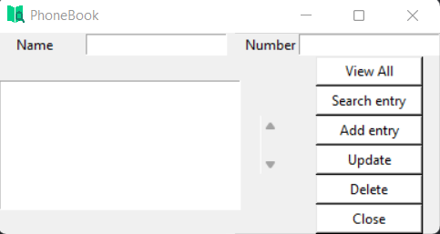
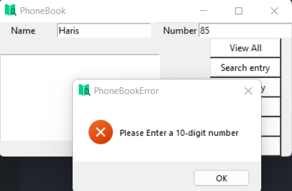
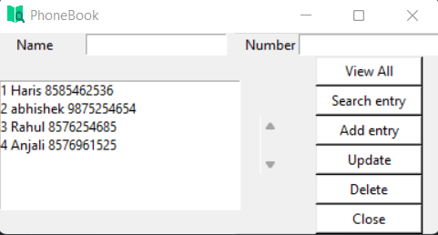

# PhoneBook Directory Application
---
A Python application that stores Contact Information in DataBase and can be accessed anywhere through the available executable file.

 ## Requirements
 - Python 3.x and above
 - Tkinter Library(built-Ins)
 - sqlite3 Library (built-Ins)
 - pyinstaller

## Making the Executable
```
pip install pyinstaller
pyinstaller --onefile -w frontend.py
```
## Screenshots





